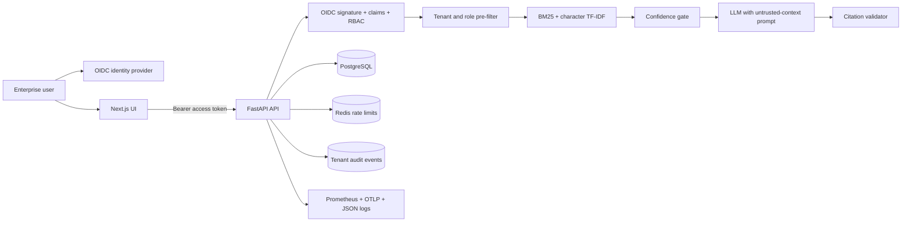

# Enterprise Internal Knowledge Assistant

[](https://github.com/Nishk23/RAG-Based-Internal-Knowledge-Assistant/actions/workflows/ci.yml)

A security-first, tenant-isolated retrieval-augmented generation reference implementation for internal knowledge. It combines a Next.js 16 OIDC/PKCE client with a FastAPI API, transactional SQL persistence, access-controlled sparse retrieval, citation validation, deterministic evaluation, audit trails, rate limiting, and production observability.

This repository implements an enterprise **application baseline**. A production approval still requires organization-specific identity configuration, network controls, secrets management, data classification, backup/restore testing, load testing, model-provider review, and a completed threat-model review.

## What changed in version 2

- OIDC JWT validation with issuer, audience, expiry, signature, tenant, and role checks.
- Role-based permissions (`reader`, `editor`, `admin`) and tenant filtering before retrieval.
- SQLAlchemy persistence with PostgreSQL production support, Alembic migrations, atomic ingestion, SHA-256 deduplication, deletion, and tenant-scoped audit events.
- Bounded file uploads, content/signature checks, strict PDF parsing, filename sanitization, extraction limits, and optional mandatory ClamAV scanning.
- Confidence-gated BM25 plus character TF-IDF retrieval; irrelevant chunks are dropped.
- Prompt-injection instructions, strict evidence-only answering, mandatory citations, and citation index validation.
- Redis-backed fixed-window rate limits that fail closed in production.
- Structured JSON logs with request correlation, Prometheus metrics, readiness/liveness probes, and optional OpenTelemetry OTLP traces.
- Deterministic quality indicators and a checked-in golden retrieval gate (Recall@K and MRR).
- Next.js 16, React 19, OIDC Authorization Code/PKCE, SWR, hardened standalone containers, pinned dependency locks, vulnerability audits, and CI.

## Architecture



The API is the security boundary. Client-side filtering is never trusted. Documents and chunks are stamped with a tenant and allowed roles; only authorized chunks are loaded before retrieval scores are calculated.

See [Architecture](docs/architecture.md), [Security](docs/security.md), and [Threat model](docs/threat-model.md).

## Security and governance controls

| Area | Implemented control |
|---|---|
| Identity | OIDC/JWT verification using configured JWKS, issuer, audience, algorithms, and required claims |
| Authorization | Endpoint RBAC plus tenant- and role-scoped document/chunk access |
| Data isolation | Tenant predicates at storage access and pre-retrieval ACL filtering |
| Ingestion | Size/page/text limits, signature/type checks, checksum dedupe, transactional writes, optional ClamAV |
| RAG safety | Confidence threshold, document-as-untrusted prompt, evidence-only response, mandatory valid citations |
| Abuse prevention | Redis rate limits for chat, upload, and evaluation; production fails closed when Redis is unavailable |
| Auditability | Append-only application audit events without raw query text; request IDs on logs and responses |
| Observability | Health/readiness, Prometheus metrics, structured JSON logs, optional OTLP traces |
| Supply chain | Exact npm lock, transitive Python lock, npm/pip audits, Dependabot, CI build/test gates |
| Runtime | Non-root multi-stage containers, read-only Compose filesystems, dropped Linux capabilities |

## Local quick start

Requirements: Docker with Compose, or Python 3.12 and Node.js 22.

```bash
cp .env.example .env
```

Change both local database passwords in `.env`, then start the stack:

```bash
docker compose up --build
```

- UI: <http://localhost:3000>
- API: <http://localhost:8000>
- API documentation (non-production only): <http://localhost:8000/docs>
- Liveness: <http://localhost:8000/health/live>
- Readiness: <http://localhost:8000/health/ready>

Development defaults to `AUTH_MODE=disabled` and a local admin principal. This mode is rejected when `ENVIRONMENT=production`.

### Run without Docker

```bash
cd backend
python3.12 -m venv .venv
source .venv/bin/activate
pip install -r requirements-dev.txt
alembic upgrade head
uvicorn app.main:app --reload --port 8000
```

```bash
cd frontend
npm ci
npm run dev
```

SQLite is the backend development default. Production configuration rejects SQLite and requires PostgreSQL.

## Production configuration

Setting `ENVIRONMENT=production` fails startup unless all critical controls are configured:

- `AUTH_MODE=oidc`
- `OIDC_ISSUER`, `OIDC_AUDIENCE`, and `OIDC_JWKS_URL`
- PostgreSQL `DATABASE_URL`
- `REDIS_URL`
- explicit `CORS_ORIGINS`
- `METRICS_BEARER_TOKEN`
- `OPENAI_API_KEY`

For browser SSO, also set the `NEXT_PUBLIC_OIDC_*` build arguments shown in `.env.example`. The identity provider must issue the configured tenant claim and at least one supported role.

Do not put production secrets in `.env` or Docker build arguments. Inject server-side secrets from the platform secret manager. `NEXT_PUBLIC_*` values are intentionally public OIDC client metadata and must not contain secrets.

Follow the [Deployment guide](docs/deployment.md), [Data governance guide](docs/data-governance.md), and [Operations runbook](docs/operations-runbook.md) before approving a production environment.

## API authorization matrix

| Endpoint | Permission |
|---|---|
| `GET /health/live`, `GET /health/ready` | Public platform probes |
| `GET /metrics` | Dedicated metrics bearer token |
| `GET /me` | Any authenticated role |
| `GET /documents`, `POST /chat` | Reader, editor, or admin |
| `POST /documents/upload`, `POST /documents/load-sample` | Editor or admin |
| `DELETE /documents/{id}`, `GET /audit-events`, `POST /evaluate` | Admin |

See [API authentication and authorization](docs/api-authentication.md) for token claims and examples.

## Retrieval and evaluation

Retrieval remains embedding-free for transparent and low-egress operation:

1. Load only chunks permitted for the authenticated tenant and roles.
2. Rank using normalized BM25 and character n-gram TF-IDF.
3. Drop results below absolute and relative confidence thresholds.
4. Treat retrieved text as untrusted data in the generation prompt.
5. Require every generated factual answer to contain valid source indexes.
6. Return a controlled abstention when no authorized evidence is sufficient.

The online `/evaluate` endpoint returns deterministic indicators without sending evaluation data to a second model. CI additionally runs the golden retrieval dataset and rejects regressions below Recall@3 `0.95` or MRR `0.85`. See [Evaluation](docs/evaluation.md).

## Verification

```bash
cd backend
ruff check app tests scripts
ruff format --check app tests scripts
mypy app
pytest --cov=app --cov-report=term-missing
python -m scripts.run_retrieval_eval
DATABASE_URL=sqlite:////tmp/migration.db ENVIRONMENT=test alembic upgrade head
pip-audit -r requirements.lock
```

```bash
cd frontend
npm ci
npm run lint
npm run typecheck
npm run build
npm audit --audit-level=high
```

The current checked-in baseline passes 39 backend tests, an 80% coverage gate, strict typing/linting, frontend lint/type/build, migration validation, dependency audits, and the golden retrieval gate.

## Documentation

- [Architecture and data flow](docs/architecture.md)
- [Security controls](docs/security.md)
- [Threat model](docs/threat-model.md)
- [API authentication and authorization](docs/api-authentication.md)
- [Production deployment](docs/deployment.md)
- [Operations runbook](docs/operations-runbook.md)
- [Data governance](docs/data-governance.md)
- [Evaluation and quality gates](docs/evaluation.md)
- [Vectorless retrieval design](docs/vectorless_rag.md)
- [Security vulnerability reporting](SECURITY.md)

## Known boundaries

- Sparse retrieval is intentionally transparent but does not provide full semantic matching. Evaluate a dense or hybrid embedding index for high-recall multilingual or paraphrase-heavy corpora.
- The included Compose stack is a reproducible single-environment reference, not a substitute for a managed HA database, managed Redis, ingress/WAF, secret manager, or orchestrator.
- ClamAV is supported but not bundled into the default Compose stack; regulated deployments should set `REQUIRE_MALWARE_SCAN=true` and provide a monitored scanner.
- OIDC claim names and role mapping must be reviewed against the organization’s identity governance process.
- Application audit rows should be exported to immutable centralized retention storage; database administrator access is outside the application threat boundary.
- Legal, privacy, records-retention, and model-provider approvals are organization-specific and cannot be solved by repository code alone.
