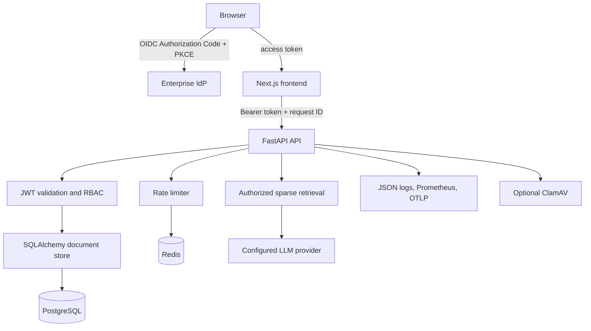
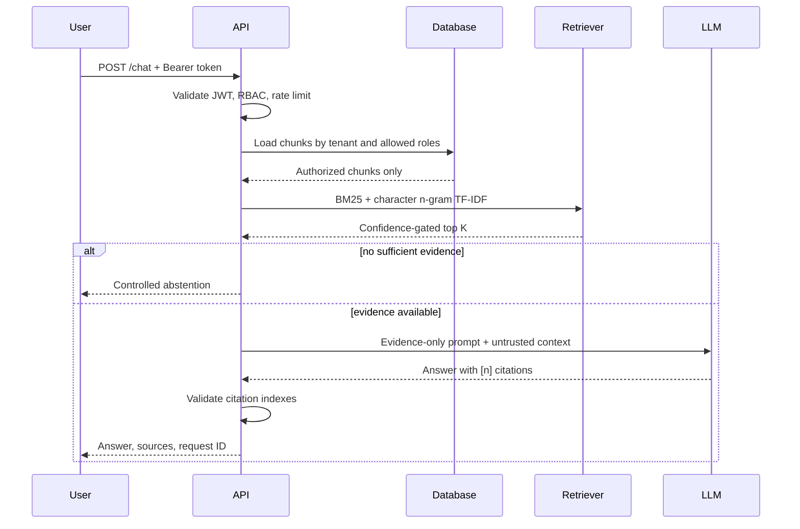

# Architecture and data flow

## Scope

The application is a tenant-isolated internal knowledge assistant. It accepts approved text,
Markdown, and PDF files, retrieves only chunks authorized for the caller, asks an LLM to answer
from that evidence, validates citations, and records security-relevant audit events.

The repository is an enterprise application baseline, not a complete enterprise platform. The
identity provider, ingress/WAF, TLS termination, secret manager, managed data services, immutable
audit sink, backups, and disaster recovery are deployment responsibilities.

## Components

- **Next.js frontend:** initiates OIDC login, keeps the OIDC session, calls the API, and renders
  answers, sources, document management, and deterministic evaluation results.
- **FastAPI API:** the security boundary. It validates identity, enforces endpoint roles and tenant
  predicates, controls ingestion and generation, and emits audit/operational telemetry.
- **PostgreSQL:** durable documents, chunks, checksums, ACL metadata, and application audit events.
  SQLite exists only for development and tests and is rejected in production.
- **Redis:** shared fixed-window rate limits. Production requests fail closed if Redis is unavailable.
- **LLM provider:** receives the question and authorized retrieved context. This is a deliberate data
  egress boundary that must be covered by the organization's provider agreement and policy.
- **ClamAV:** optional upload malware scanning. Set `REQUIRE_MALWARE_SCAN=true` to fail closed.

## Request trust boundaries

1. The browser obtains an access token from the configured OIDC identity provider using
   Authorization Code with PKCE.
2. The API independently validates the JWT signature, issuer, audience, expiry, issued-at time, and
   subject. It maps configured tenant and role claims to a principal.
3. Endpoint RBAC controls operations. Tenant and allowed-role predicates are applied in database
   access before any candidate reaches retrieval scoring.
4. Rate limits use tenant and principal-aware keys. Redis is shared across API workers.
5. The API supplies only authorized chunks to the retriever and LLM. Client-side state is never used
   as authorization evidence.

## Ingestion flow

1. Require `editor` or `admin`.
2. Stream the upload with a byte limit; never trust the declared content length.
3. Sanitize the filename and allow only `.txt`, `.md`, and `.pdf`.
4. Validate file signatures/content, reject NUL-containing text, parse PDFs strictly, and enforce
   page and extracted-character limits.
5. If configured, scan the original bytes with ClamAV.
6. Compute SHA-256, chunk normalized text, and store document plus chunks atomically.
7. Enforce checksum deduplication per tenant and write an audit event.

## Query flow

Raw questions are not stored in application audit rows; a SHA-256 digest supports correlation
without preserving query content. Operational logging similarly avoids document text and prompts.

## Availability and scaling

API workers are stateless apart from cached JWKS metadata. PostgreSQL and Redis are shared state, so
multiple workers or replicas can be run behind an ingress. Run Alembic as a single deployment job
before rolling out application replicas. Use managed HA PostgreSQL/Redis, connection limits, pod
disruption budgets, and autoscaling based on measured latency and saturation.

The checked-in Compose file is intentionally single-environment and binds application ports to
localhost. It is for reproducible evaluation, not high availability.

## Design decisions

- Sparse retrieval avoids embedding storage and an additional embedding-provider egress path. It is
  inspectable and inexpensive, but less capable on paraphrases and multilingual corpora.
- Deterministic evaluation avoids sending evaluation material to another model. It is a regression
  signal, not a substitute for expert review or representative offline benchmarks.
- The application audit table is useful for product and security investigations, but immutable SIEM
  export is required to protect records from database administrators.
